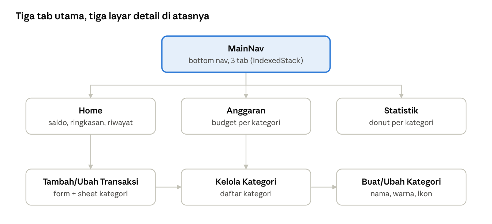
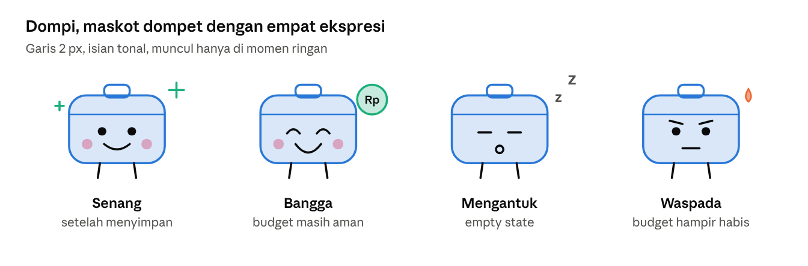
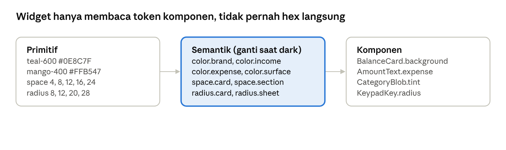
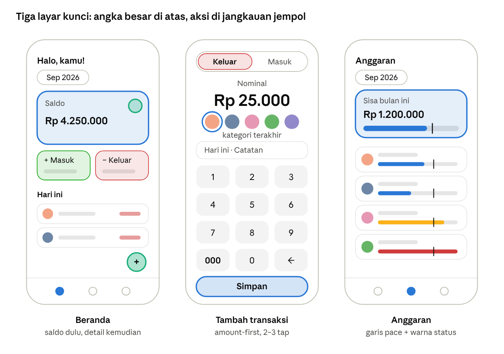
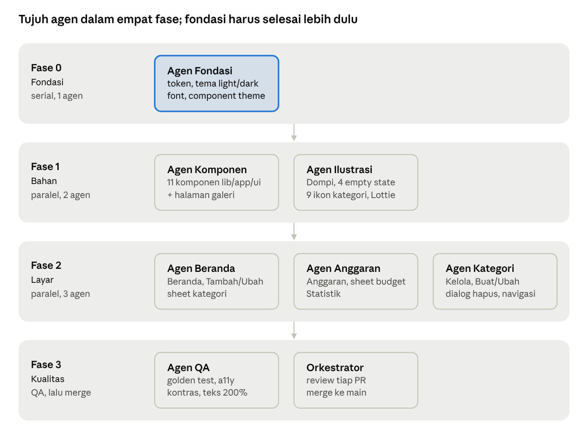

# Wister Lite — Rencana Redesign Total

28 September 2026 · Amas Parera

> Versi live (bisa dikomentari): https://claude.ai/code/artifact/bbd29b53-f24e-4364-bb16-778a987ceb70

## Ringkasan

Wister Lite akan didesain ulang total dengan arah visual yang hangat dan penuh ilustrasi kecil. Fitur tetap sama persis: transaksi, kategori, anggaran bulanan, dan statistik. Yang berubah hanya tampilan, alur interaksi, dan fondasi design system.

Alasannya: UI sekarang terasa seperti dibuat di tiga era berbeda. Ada sekitar 149 warna hardcoded, 6 ukuran radius, dua gaya dialog hapus, dan empty state yang hanya berupa teks abu-abu.

**Prinsip redesign**

1. **Fitur tetap, rasa baru.** Tidak ada fitur yang ditambah atau dihapus. Model data dan skema SQLite tidak disentuh.
2. **Satu sumber kebenaran visual.** Semua warna, tipografi, radius, dan jarak berasal dari token, bukan dari nilai lepas.
3. **Menyenangkan tapi tetap jelas.** Ilustrasi dan animasi mendukung pemahaman, bukan hiasan yang mengganggu angka.
4. **Mencatat dalam 5 detik.** Alur tambah transaksi dibuat secepat mungkin.
5. **Siap mode gelap dan aksesibel sejak awal.** Kontras minimal WCAG AA, teks minimal 14 sp, dan label semantik di setiap ikon.

## Kondisi saat ini

Aplikasi ini kecil: sekitar 3.300 baris Dart, 7 layar, GetX, sqflite, dan fl_chart. Semua data offline di SQLite. Fitur yang harus dipertahankan persis sama:

- **Transaksi:** tambah, ubah, hapus pemasukan/pengeluaran; riwayat per hari dengan paginasi 10 item.
- **Kategori:** 9 bawaan + kategori custom (nama, 9 warna, 9 ikon SVG); tidak bisa dihapus jika masih dipakai.
- **Anggaran:** satu budget per kategori per bulan, progress terpakai vs budget.
- **Statistik:** saldo bulan ini, donut pengeluaran per kategori, daftar persentase.

Kelola Kategori juga bisa dibuka dari sheet kategori di form transaksi, jadi layar ini punya dua pintu masuk.

**Masalah UI/UX yang ditemukan**

| Area | Masalah | Dampak |
| --- | --- | --- |
| Design system | ~149 warna hardcoded, radius 6/8/12/16/20/30, TextStyle lepas | Tampilan tidak konsisten, tema M3 tidak berpengaruh |
| Konsistensi | Home & form bergaya outlined, Budget/Statistik bergaya filled grey; 2 dialog hapus, 2 gaya FAB | Terasa seperti dua aplikasi |
| Warna semantik | Pemasukan tampil teal, green, dan greenAccent; pengeluaran red dan redAccent | Makna warna kabur |
| Mode gelap | `ThemeMode.system` tanpa darkTheme, putih/hitam hardcoded | Rusak di HP dengan dark mode |
| Form transaksi | Judul selalu "Pengeluaran"; Tanggal kosong padahal default hari ini; nominal berupa field biasa | Mencatat lambat dan membingungkan |
| Sheet kategori | Kategori baru tidak muncul sampai form dibuka ulang | Alur putus |
| Data basi | Tab Anggaran & Statistik hanya load saat onInit | Angka tidak update setelah menambah transaksi |
| Bulan aktif | Tidak ada label bulan, hanya ikon filter | User tidak tahu sedang melihat bulan apa |
| Empty state | Hanya teks abu-abu, tanpa ilustrasi atau ajakan | Terasa kosong dan membosankan |
| Aksesibilitas | Teks 11–12 px, putih di atas teal/kuning, ikon tanpa label semantik | Gagal kontras AA |
| Navigasi | Label "Home" campur Indonesia; ikon pie di Anggaran, bar di Statistik (padahal isinya pie) | Ikon menyesatkan |
| Home | Nama "User" hardcoded; saldo all-time tanpa penjelasan; total hari ini dihitung tapi tidak tampil | Informasi setengah jadi |

## Riset: apa yang membuat aplikasi keuangan terasa menyenangkan

Pola yang berulang di aplikasi keuangan terbaik 2025–2026: satu angka besar di depan, gaya ilustrasi yang punya suara sendiri, dan pencatatan yang secepat mengetik angka.

| Referensi | Yang diambil untuk Wister Lite |
| --- | --- |
| [Copilot Money](https://blakecrosley.com/guides/design/copilot-money) | Angka display besar dengan tabular figures; chart sebagai UI utama; warna semantik tetap untuk pemasukan/pengeluaran |
| [Monzo](https://www.creativereview.co.uk/monzo-branding-ragged-edge/) | Satu warna signature + ~90 ilustrasi gambar tangan yang tidak generik |
| [Cleo](https://www.izzoul.com/product-design/cleo-ai) | Nada copy yang akrab dan sedikit jenaka, konsisten di semua layar |
| [Money Lover](https://apps.apple.com/us/app/money-lover-money-manager/id486312413?see-all=reviews) | Maskot celengan yang dipakai hemat, hanya di momen tertentu |
| [Bank Jago](https://doi.org/10.47080/simika.v9i1.4019) | Studi UEQ: skor tampilan tertinggi (1,67), efisiensi lebih rendah. Tampilan cantik tidak menutupi alur yang lambat |
| Spendee, YNAB | Tampilan sekilas-baca dan pencatatan cepat |

**Insight yang dipakai (tanpa menambah fitur)**

- **Empty state = ilustrasi + judul + satu kalimat + satu tombol.** Ilustrasi mendukung copy, tidak menggantikannya ([Eleken](https://www.eleken.co/blog-posts/empty-state-ux), [Carbon](https://carbondesignsystem.com/patterns/empty-states-pattern/)).
- **Maskot hanya di momen ringan:** empty state, sukses menyimpan, budget aman. Jangan muncul saat over-budget atau error.
- **Donut maksimal 6 irisan + "Lainnya"**, total di tengah, daftar berperingkat di bawahnya.
- **Progress budget dengan penanda pace:** bandingkan terpakai dengan posisi hari ini di bulan berjalan, bukan hanya "70% terpakai".
- **Input nominal amount-first dengan keypad sendiri:** tombol "000", pemisah ribuan langsung (Rp 25.000), tanpa desimal. Target 2–3 tap per transaksi.
- **Warna tidak boleh jadi satu-satunya penanda:** selalu dipasangkan dengan +/− atau ikon. Sekitar 8% pria buta warna merah-hijau ([Color Archive](https://colorarchive.org/guides/financial-ui-color-guide/)).
- **Merah pengeluaran dilunakkan ke coral;** merah kuat hanya untuk over-budget, amber untuk hampir habis.
- **Motion:** [flutter_animate](https://pub.dev/packages/flutter_animate) untuk list bertahap, angka count-up, dan shimmer; [Rive](https://rive.app) untuk maskot yang bereaksi; Lottie untuk momen sukses. Hormati `MediaQuery.disableAnimations`.
- **M3 Expressive** (Mei 2025): pegas, kontras bentuk, permukaan tonal. Belum ada di core Flutter ([issue #168813](https://github.com/flutter/flutter/issues/168813)), jadi dibuat manual dengan `SpringSimulation`.

**Diparkir karena menambah fitur:** streak pencatatan, badge, recap bulanan ala "Wrapped", widget home screen, dan saldo harian yang disarankan. Semua bagus untuk fase berikutnya, tapi di luar scope redesign ini.

## Arah visual baru: "Dompet yang Ceria"

Mood-nya hangat, ramah, dan sedikit jenaka, seperti teman yang membantu mencatat uang, bukan bank yang menghakimi. Warna teal lama dipertahankan sebagai benang merah, ditambah aksen mangga yang hangat.

**Palet warna (usulan)**

| Token | Light | Dark | Dipakai untuk |
| --- | --- | --- | --- |
| `brand` Laut | `#0E8C7F` | `#4FD1C0` | Tombol utama, tab aktif, kartu saldo |
| `accent` Mangga | `#FFB547` | `#FFC56B` | Sorotan, ilustrasi, FAB |
| `surface` Krem / Malam | `#FFF8EE` | `#101C24` | Latar halaman (bukan putih/hitam murni) |
| `ink` | `#1B2430` | `#E8EDF0` | Teks utama |
| `ink-muted` | `#5B6573` | `#9AA6B2` | Teks sekunder |
| `income` | `#1E9E5A` | `#4ADE80` | Pemasukan, selalu dengan tanda + |
| `expense` Coral | `#F0634A` | `#FF8A73` | Pengeluaran harian, selalu dengan tanda − |
| `warning` Amber | `#E08A00` | `#FBBF24` | Budget di atas 80% |
| `danger` | `#D92D20` | `#F97066` | Over-budget, hapus |

Warna semantik (income, expense, warning, danger) dipatok, tidak ikut dynamic color. Semua pasangan teks harus lolos kontras 4,5:1; angka di atas dicek ulang saat token dibuat.

**Tipografi**

- [Plus Jakarta Sans](https://fonts.google.com/specimen/Plus+Jakarta+Sans), font karya studio Jakarta, di-bundle ke assets (bukan diunduh saat runtime).
- Angka memakai fitur tabular figures (`FontFeature.tabularFigures()`) agar digit tidak bergoyang saat count-up.
- Skala: Display 40/48 untuk saldo, Headline 24/32, Title 18/24, Body 16/24, Label 14/20. Tidak ada teks di bawah 12 sp.

**Bentuk dan permukaan**

- Radius hanya lima nilai: 8 (chip), 12 (input), 20 (kartu), 28 (sheet), full (FAB, avatar).
- Kartu tanpa bayangan tebal; kedalaman dari warna tonal, seperti M3 Expressive.
- Ikon kategori berada di wadah "blob" tonal dengan warna kategori 15%.

**Ilustrasi kecil**

- Satu gaya: line-art 2 px, sudut membulat, isian datar dari palet, sedikit tidak sempurna seperti gambar tangan.
- Spot illustration 96–160 px untuk empty state; micro-illustration 24–40 px untuk kartu status (misalnya "hari ini belum ada pengeluaran").
- Maskot bernama **Dompi**, dompet kecil dengan empat ekspresi:

Dompi tidak pernah muncul di layar yang tegang, seperti over-budget atau error. Di sana cukup ikon dan teks yang jelas.

**Motion**

- Masuk list bertahap 40 ms per item, angka saldo count-up 600 ms, kartu tekan skala 0,97.
- Sukses simpan: centang Lottie kecil + haptic ringan + snackbar dengan tombol Urungkan.
- Semua animasi diganti crossfade saat `disableAnimations` aktif.

## Design system

Semua tampilan lahir dari token tiga lapis yang dibungkus sebagai `ThemeExtension` Flutter. Tujuannya: 0 warna hardcoded di folder `modules/`.

Mode gelap cukup mengganti lapis semantik. Primitif dan komponen tetap sama.

**Struktur folder baru**

- `lib/app/theme/tokens/` berisi warna, spasi, radius, tipografi, dan durasi motion.
- `lib/app/theme/app_theme.dart` berisi `light()` dan `dark()` dengan component theme lengkap (AppBar, Input, FilledButton, Card, NavigationBar, BottomSheet, SnackBar, Chip).
- `lib/app/ui/` berisi komponen bersama yang menggantikan widget lokal yang sekarang terduplikasi.

**Komponen inti**

| Komponen | Menggantikan | Catatan |
| --- | --- | --- |
| `BalanceCard` | Dekorasi kartu primary yang di-copy 3 kali | Angka display count-up, pola ilustrasi halus di pojok |
| `AmountText` | Teks nominal dengan warna campur | Tanda +/− wajib, label semantik untuk screen reader |
| `CategoryBlob` | CircleAvatar dan ikon SVG polos | Wadah blob tonal 15%, ukuran 32/40/56 |
| `TransactionTile` | `MainTile` tinggi tetap 67 | Tinggi fleksibel, menampilkan kategori, swipe untuk hapus |
| `BudgetProgress` | LinearProgressIndicator | Penanda pace hari ini; warna brand, lalu amber di 80%, danger di atas 100% |
| `AmountKeypad` | Field Nominal biasa | Keypad sendiri dengan tombol 000 dan hapus, target sentuh 56 dp |
| `MonthSwitcher` | Ikon filter tanpa label | Chip "September 2026" dengan panah kiri/kanan (memakai method prev/next yang sudah ada) |
| `AppSheet` | Beberapa bottom sheet ad-hoc | Radius 28, handle, judul, satu tombol utama |
| `ConfirmDialog` | Dua gaya dialog hapus | Satu dialog dengan ilustrasi kecil |
| `EmptyState` | Teks "Belum ada …" | Ilustrasi + judul + satu kalimat + satu tombol |
| `SkeletonList` | Spinner satu layar penuh | Shimmer mengikuti bentuk konten |

**Ikon**

- Ikon navigasi dan aksi pindah ke satu set bergaris bulat (misalnya Phosphor, versi "regular" dan "fill" untuk status aktif).
- 9 ikon kategori Unicons digambar ulang dalam gaya ilustrasi yang sama. Tidak ada ikon kategori baru, karena itu menambah fitur.

## Redesign per layar

Setiap layar tetap melakukan hal yang sama, tetapi dengan susunan baru: angka terpenting di atas, aksi di jangkauan jempol, dan sentuhan ilustrasi di tempat yang pas.

Garis tegak di bar anggaran adalah posisi hari ini di bulan berjalan. Bar yang melewatinya berarti belanja lebih cepat dari jadwal.

| Layar | Susunan baru | Sentuhan ilustrasi |
| --- | --- | --- |
| **Navigasi utama** | M3 `NavigationBar` dengan label Beranda, Anggaran, Statistik; ikon diperbaiki (dompet, target, donut); FAB tengah untuk tambah | Ikon aktif berubah jadi versi fill dengan pegas kecil |
| **Beranda** | Sapaan + chip bulan; `BalanceCard` dengan label "Saldo total" yang jelas; dua kartu Masuk/Keluar bulan ini; baris "Hari ini: Rp x" (sudah dihitung controller, tinggal ditampilkan); riwayat per hari dengan header tanggal lengket | Pola koin halus di kartu saldo; Dompi mengantuk saat riwayat kosong |
| **Tambah/Ubah Transaksi** | Full-screen sheet; toggle Keluar/Masuk mengubah judul dan warna; nominal besar + `AmountKeypad`; 5 kategori terakhir sebagai chip + "Semua"; tanggal default hari ini, terisi dari data saat edit; catatan opsional | Dompi senang + centang Lottie saat tersimpan |
| **Sheet kategori** | Grid 4 kolom dengan `CategoryBlob`; kategori baru langsung muncul (list reaktif, bukan statis) | Tile "Buat baru" bergambar tanda + gambar tangan |
| **Anggaran** | `MonthSwitcher` terlihat; kartu "Sisa bulan ini"; `BudgetProgress` dengan garis pace; kategori tanpa budget dikelompokkan di bawah dengan tombol "Atur" | Dompi bangga saat semua budget di bawah pace |
| **Sheet atur budget** | Judul memuat nama kategori dan pengeluaran bulan ini sebagai konteks; nominal pakai `AmountKeypad` | Blob kategori besar di header |
| **Statistik** | `MonthSwitcher`; donut maksimal 6 irisan + "Lainnya", total di tengah; kartu Masuk/Keluar/Selisih; daftar berperingkat dengan persen | Irisan tumbuh dari tengah saat pertama tampil |
| **Kelola Kategori** | List kartu dengan `CategoryBlob`; FAB sama dengan Beranda | Empty state dengan ilustrasi palet warna |
| **Buat/Ubah Kategori** | Pratinjau langsung di atas (blob + nama); pilihan warna dan ikon dalam chip; validasi inline, bukan snackbar | Pratinjau "memantul" setiap kali warna atau ikon diganti |
| **Dialog hapus** | Satu `ConfirmDialog` untuk transaksi dan kategori; pesan ramah jika kategori masih dipakai | Ilustrasi tempat sampah kecil |

**Empty state yang disiapkan (4 ilustrasi)**

- Beranda: "Belum ada catatan. Yuk, catat pengeluaran pertamamu." + tombol Tambah.
- Anggaran: "Belum ada anggaran bulan ini." + tombol Atur anggaran.
- Statistik: "Bulan ini masih bersih." + tombol Tambah transaksi.
- Kelola Kategori: "Kategorimu kosong." + tombol Buat kategori.

## Rencana eksekusi multi-agent

Pekerjaan dibagi ke 7 agen Claude Code dalam 4 fase. Setiap agen bekerja di git worktree sendiri dan hanya menyentuh folder miliknya, jadi agen dalam satu fase bisa jalan bersamaan tanpa konflik.

Fase 1 dan 2 berjalan paralel di dalam fase. Fase berikutnya baru mulai setelah orkestrator me-review dan me-merge PR fase sebelumnya.

| Agen | Folder yang dimiliki | Deliverable | Selesai jika |
| --- | --- | --- | --- |
| **Fondasi** | `lib/app/theme/`, `pubspec.yaml`, `assets/fonts/` | Token 3 lapis, `AppTheme.light()` / `dark()`, Plus Jakarta Sans di-bundle, component theme lengkap | `flutter analyze` bersih; app berjalan dengan tema baru di light dan dark |
| **Komponen** | `lib/app/ui/` | 11 komponen inti + halaman galeri debug untuk melihat semuanya | Semua komponen hanya memakai token; golden test per komponen di light/dark |
| **Ilustrasi** | `assets/illustrations/`, `assets/icons/`, `assets/lottie/` | Dompi (4 ekspresi), 4 spot empty state, 9 ikon kategori baru, 1 animasi sukses | SVG di bawah 8 KB per file; nama file lama ikon tetap agar data kategori di SQLite tidak rusak |
| **Beranda** | `modules/home/`, `modules/main_nav/`, `modules/expanse_create/` | Beranda, navigasi, form transaksi dengan keypad, sheet kategori reaktif | Tambah transaksi dalam 3 tap; tanggal default terisi; judul ikut tipe |
| **Anggaran** | `modules/budget/`, `modules/statistik/` | Anggaran dengan pace, Statistik dengan donut 6+1, `MonthSwitcher` | Tab ter-refresh otomatis setelah transaksi disimpan |
| **Kategori** | `modules/category_list/`, `modules/category_create/` | Kelola dan Buat/Ubah kategori, `ConfirmDialog` bersama | Validasi inline; satu gaya dialog hapus |
| **QA** | `test/` (baru) | Golden test semua layar, cek kontras, uji teks 200% dan TalkBack/VoiceOver | Tidak ada overflow; semua ikon punya label semantik |

**Aturan main untuk semua agen**

1. Dilarang mengubah `lib/app/data/` (model, repository, database). Fitur dan data tetap persis sama.
2. Dilarang menambah fitur. Temuan fitur baru dicatat di daftar "Diparkir".
3. Tidak boleh ada `Color(0x…)`, `Colors.*`, atau `TextStyle(` lepas di `modules/`. Dicek dengan grep oleh agen QA.
4. Semua teks tetap Bahasa Indonesia; perbaikan copy dilakukan di tempat yang sama.
5. Setiap PR menyertakan screenshot sebelum/sesudah di light dan dark.

**Cara menjalankannya di Claude Code**

- Fase 0: satu sesi biasa, lalu review manual.
- Fase 1–3: minta sesi utama menjalankan workflow multi-agent ("use a workflow") dengan satu agen per baris tabel di atas dan `isolation: worktree`.
- Prompt setiap agen menyertakan bagian Arah visual, Design system, dan baris layar yang relevan dari doc ini.

## Gerbang, risiko, dan metrik sukses

Setiap fase punya satu gerbang yang harus lolos sebelum fase berikutnya dimulai. Tanggal belum ditentukan.

1. **Gerbang Fondasi:** app berjalan di light dan dark tanpa layar rusak; token disetujui pemilik produk.
2. **Gerbang Bahan:** galeri komponen dan semua ilustrasi di-review dalam satu sesi; gaya Dompi dikunci.
3. **Gerbang Layar:** semua 7 layar selesai; skenario uji manual (tambah, ubah, hapus transaksi; atur budget; buat kategori) lolos.
4. **Gerbang Rilis:** QA hijau; APK split-per-ABI baru dibuat dan README diperbarui dengan screenshot baru.

| Risiko | Mitigasi |
| --- | --- |
| Redesign diam-diam mengubah perilaku data | `lib/app/data/` dikunci; QA membandingkan isi SQLite sebelum/sesudah skenario uji yang sama |
| Ilustrasi buatan agen terasa generik | Agen Ilustrasi membuat 3 gaya sketsa Dompi dulu; pemilik memilih satu sebelum produksi. Opsi: ilustrator manusia untuk 4 spot empty state |
| Ikon kategori lama tersimpan sebagai path di database | Path file ikon dipertahankan; hanya isi SVG yang diganti |
| Konflik merge antar agen | Kepemilikan folder tegas; `pubspec.yaml` hanya diubah Agen Fondasi |
| Animasi terasa berlebihan atau berat | Durasi dari token motion; hormati `disableAnimations`; uji di HP Android kelas menengah |
| Belum ada test sama sekali | Agen QA menambah golden test sebagai jaring pengaman untuk perubahan berikutnya |

**Metrik sukses**

- 0 warna dan `TextStyle` hardcoded di `modules/` (dari ~149 warna hari ini).
- Tambah transaksi dalam 3 tap atau kurang, dari buka app sampai tersimpan.
- Semua teks lolos kontras 4,5:1 dan tidak ada teks di bawah 12 sp.
- Mode gelap lengkap di 7 layar.
- 4 empty state bergambar, menggantikan 4 teks abu-abu.
- Fitur identik: semua skenario uji manual memberi hasil data yang sama seperti versi lama.

## Sumber

- [Copilot Money design guide](https://blakecrosley.com/guides/design/copilot-money) · [Apple: Copilot Money](https://developer.apple.com/articles/copilot-money/)
- [Creative Review: Monzo branding](https://www.creativereview.co.uk/monzo-branding-ragged-edge/) · [Monzo: Year in Monzo](https://monzo.com/blog/writing-year-in-monzo-2024)
- [Cleo AI product design](https://www.izzoul.com/product-design/cleo-ai)
- [Studi UEQ Bank Jago](https://doi.org/10.47080/simika.v9i1.4019)
- [Eleken: empty state UX](https://www.eleken.co/blog-posts/empty-state-ux) · [Carbon: empty states](https://carbondesignsystem.com/patterns/empty-states-pattern/)
- [Color Archive: financial UI color guide](https://colorarchive.org/guides/financial-ui-color-guide/)
- [M3 Expressive motion](https://m3.material.io/blog/m3-expressive-motion-theming) · [Flutter issue #168813](https://github.com/flutter/flutter/issues/168813) · [Decoupling Material & Cupertino](https://flutter.dev/blog/decoupling-material-cupertino)
- [flutter_animate](https://pub.dev/packages/flutter_animate) · [Rive vs Lottie untuk Flutter](https://tillitsdone.com/blogs/rive-vs-lottie--flutter-animations/)
